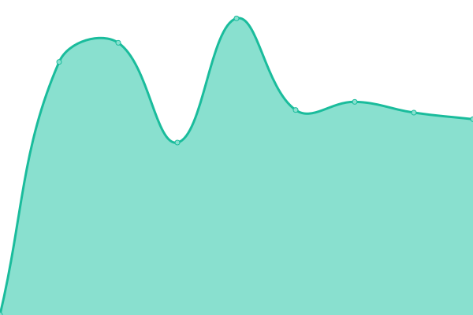

# [📈 Live Status](https://kilobyteno.github.io/status.kilobyte.no): <!--live status--> **🟩 All systems operational**

This repository contains the open-source uptime monitor and status page for [Kilobyte AS](https://kilobyte.no), powered by [Upptime](https://github.com/upptime/upptime).

With [Upptime](https://upptime.js.org), you can get your own unlimited and free uptime monitor and status page, powered entirely by a GitHub repository. We use [Issues](https://github.com/kilobyteno/status.kilobyte.no/issues) as incident reports, [Actions](https://github.com/kilobyteno/status.kilobyte.no/actions) as uptime monitors, and [Pages](https://kilobyteno.github.io/status.kilobyte.no) for the status page.

<!--start: status pages-->
<!-- This summary is generated by Upptime (https://github.com/upptime/upptime) -->
<!-- Do not edit this manually, your changes will be overwritten -->
<!-- prettier-ignore -->
| URL | Status | History | Response Time | Uptime |
| --- | ------ | ------- | ------------- | ------ |
|  [kilobyte.no](https://kilobyte.no) | 🟩 Up | [kilobyte-no.yml](https://github.com/kilobyteno/status.kilobyte.no/commits/HEAD/history/kilobyte-no.yml) | 

 865ms
     
 | 

<a href="https://status.kilobyte.no/history/kilobyte-no">100.00%</a>
    

|  [lanms.net](https://lanms.net) | 🟩 Up | [lanms-net.yml](https://github.com/kilobyteno/status.kilobyte.no/commits/HEAD/history/lanms-net.yml) | 

 842ms
     
 | 

<a href="https://status.kilobyte.no/history/lanms-net">100.00%</a>
    

|  [oppe.app](https://oppe.app) | 🟩 Up | [oppe-app.yml](https://github.com/kilobyteno/status.kilobyte.no/commits/HEAD/history/oppe-app.yml) | 

 835ms
     
 | 

<a href="https://status.kilobyte.no/history/oppe-app">100.00%</a>
    

<!--end: status pages-->

[**Visit our status website →**](https://kilobyteno.github.io/status.kilobyte.no)

## 📄 License

- Powered by: [Upptime](https://github.com/upptime/upptime)
- Code: [MIT](./LICENSE) © [Kilobyte AS](https://kilobyte.no)
- Data in the `./history` directory: [Open Database License](https://opendatacommons.org/licenses/odbl/1-0/)
